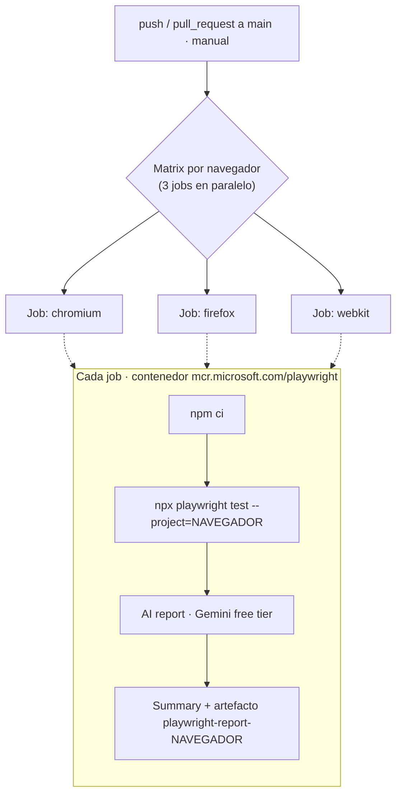

# Playwright E2E · SauceDemo con reporte IA de fallos

Proyecto de automatización de pruebas end-to-end sobre [SauceDemo](https://www.saucedemo.com) utilizando [Playwright](https://playwright.dev/) con TypeScript y el patrón **Page Object Model (POM)**.

---

## Estructura del proyecto

```
playwright-demo-ia-mcp/
├── pages/
│   ├── login.page.ts               # POM: página de login
│   ├── inventory.page.ts           # POM: catálogo de productos
│   ├── product-detail.page.ts      # POM: detalle de producto
│   ├── cart.page.ts                # POM: carrito de compras
│   ├── checkout.page.ts            # POM: proceso de checkout
│   └── menu.page.ts                # POM: menú lateral
├── tests/                          # 14 ficheros, 79 tests
├── specs/                          # Planes de test y documentación QA
├── prompts/                        # Prompts usados por el reporte IA
├── scripts/
│   └── report-ai.mjs               # Script de análisis IA de resultados
├── .github/workflows/
│   └── playwright.yml              # Pipeline CI/CD (GitHub Actions)
├── playwright.config.ts
├── package.json
└── tsconfig.json
```

---

## Requisitos previos

- [Node.js](https://nodejs.org/) v18 o superior (npm se instala con Node)
- [Claude Code CLI](https://claude.ai/code) — opcional, solo para `report:ai` en local (ver [Instalación](#instalación))

> **¿Varias versiones de Node?** Usa [nvm](https://github.com/nvm-sh/nvm) para instalar y cambiar entre versiones sin conflictos:
>
> ```bash
> nvm install 18   # instala Node.js 18 (incluye npm)
> nvm use 18       # activa esa versión en la sesión actual
> ```
>
> En Windows usa [nvm-windows](https://github.com/coreybutler/nvm-windows) (misma sintaxis).

---

## Instalación

```bash
npm install
npx playwright install    # Chromium, Firefox y WebKit
```

### Claude Code CLI (opcional, solo para `report:ai` en local)

```bash
npm install -g @anthropic-ai/claude-code
```

Ejecuta `claude` una vez para autenticarte y sigue el login. En CI el AI report se genera con Gemini, así que el CLI no hace falta allí.

---

## Ejecución de los tests

```bash
# Modo headless (por defecto) — los 3 navegadores
npm test
npm run test:all        # alias explícito de lo anterior

# Un solo navegador
npm run test:chromium
npm run test:firefox
npm run test:webkit

# Modo headed (navegador visible)
npm run test:headed

# Demo: separar suite verde de fallos intencionados
npm run test:demo:green   # solo tests que pasan (excluye @demo-fail)
npm run test:demo:fail    # solo los fallos intencionados (@demo-fail)

# Ver el informe HTML tras la ejecución
npm run test:report
```

Los tests se ejecutan en **Chromium, Firefox y WebKit** (definidos como `projects` en `playwright.config.ts`).

Los fallos intencionados llevan el tag `@demo-fail`. `test:demo:green` demuestra la suite en verde; `test:demo:fail` aísla los fallos que alimentan el AI report.

---

## Docker

El proyecto puede ejecutar los tests dentro del contenedor oficial de Playwright. La imagen trae Node, los tres navegadores y todas las dependencias del sistema preinstaladas, garantizando un **entorno idéntico** en local y en CI.

> El tag de la imagen (`v1.58.2-jammy`) debe coincidir con la versión de `@playwright/test` del `package-lock.json`. Si actualizas Playwright, actualiza también el tag en el workflow y en los comandos.

### ¿Cuándo usar Docker?

- **CI/CD:** entorno reproducible sin instalar navegadores en cada run.
- **Consistencia entre equipos:** mismo navegador, misma versión, mismo SO. Elimina el "en mi máquina funciona".
- **Reproducir el CI en local** antes de subir cambios.

Para el desarrollo diario iterando tests, ejecuta `npm test` directamente: Docker añade una capa más lenta sin beneficio en ese caso.

### Ejecutar los tests en Docker (local)

Replica exactamente el entorno del CI. Requiere **Docker Desktop** en ejecución y ejecutarse desde la raíz del proyecto.

```powershell
# PowerShell (recomendado en Windows)
docker run --rm -v "${PWD}:/work" -w /work mcr.microsoft.com/playwright:v1.58.2-jammy bash -c "npm ci && npx playwright test"
```

```bash
# Git Bash (desactiva la conversión de rutas de MSYS)
MSYS_NO_PATHCONV=1 docker run --rm -v "/$(pwd):/work" -w //work mcr.microsoft.com/playwright:v1.58.2-jammy bash -c "npm ci && npx playwright test"
```

El volumen montado (`-v`) persiste el `playwright-report/` generado en tu disco. Para verlo tras el run necesitas Playwright instalado en local:

```bash
npm ci
npm run test:report
```

### Docker en CI (GitHub Actions)

El workflow [`.github/workflows/playwright.yml`](.github/workflows/playwright.yml) ejecuta el job dentro de la imagen mediante `container:`. No necesita pasos de `setup-node` ni `playwright install`: la imagen ya lo trae todo.

Se dispara con `push` o `pull_request` a `main`, o manualmente:

```bash
# Lanzar el workflow manualmente (requiere gh CLI)
gh workflow run "Playwright Tests"

# Seguir el último run en vivo
gh run watch
```

### Flujo del pipeline



> Los tests fallan a propósito (es una demo): el valor está en ver el **AI report** analizar fallos reales. Cada navegador genera su propio reporte y artefacto.

---

## Reporte IA (`report:ai`)

El script `report:ai` analiza los resultados de la última ejecución con un modelo de IA y genera cuatro ficheros de salida en `playwright-report/`.

### Proveedor de IA

El script elige el proveedor según el entorno:

- **En local:** el CLI de Claude (`claude`) con tu suscripción. No requiere API key.
- **En CI:** si existe la variable `GEMINI_API_KEY`, usa **Google Gemini** (`gemini-flash-latest`, free tier). Así el pipeline no consume crédito de pago.

La presencia de `GEMINI_API_KEY` es lo que decide el proveedor (ver `runClaude` en [`scripts/report-ai.mjs`](scripts/report-ai.mjs)).

### Cómo funciona

```
test-results.json  ──▶  IA (Claude local / Gemini CI)  ──▶  playwright-report/
                         │
                         ├── Agrupa fallos por categoría
                         ├── Genera resumen ejecutivo
                         ├── Propone correcciones por fallo
                         └── Crea tickets Jira listos para importar
```

El resumen, las correcciones y los tickets se ejecutan en **paralelo** tras la agrupación de fallos.

### Ficheros generados

| Fichero | Descripción |
|---------|-------------|
| `playwright-report/ai-summary.txt` | Resumen ejecutivo: totales, estado global y conclusión |
| `playwright-report/ai-corrections.md` | Posibles causas y correcciones para cada fallo |
| `playwright-report/ai-tickets.json` | Tickets en formato Jira (JSON importable) |
| `playwright-report/ai-failures-grouped.json` | Fallos agrupados por categoría de error |

### Uso en local

```bash
# Opción 1: solo el reporte (requiere haber ejecutado los tests antes)
npm run test
npm run report:ai

# Opción 2: tests + reporte en un único comando
npm run test:ai
```

### Uso en CI (GitHub Actions)

El reporte se ejecuta automáticamente en cada job (uno por navegador). El resumen aparece en la pestaña **Summary** del workflow sin necesidad de descargar ningún artefacto.

Requiere el secret `GEMINI_API_KEY` configurado en el repositorio:
**Settings > Secrets and variables > Actions > New repository secret**

Crea una key gratuita (sin tarjeta) en [aistudio.google.com/apikey](https://aistudio.google.com/apikey).

---

## Modo headless

El modo **headless** ejecuta los tests sin abrir ventana de navegador. Es el modo por defecto y el recomendado para CI/CD.

```bash
# Un fichero específico
npx playwright test tests/login.spec.ts

# Un test por nombre (grep)
npx playwright test --grep "debería redirigir a la página de inventario"

# Con reintentos y tracing
npx playwright test --retries=2 --trace=on
```

---

## Configuración (`playwright.config.ts`)

| Parámetro | Valor |
|-----------|-------|
| `baseURL` | `https://www.saucedemo.com` |
| `testDir` | `./tests` |
| `reporter` | HTML + JSON (local) · GitHub + HTML + JSON (CI) |
| `trace` | `on-first-retry` |
| `video` | `retain-on-failure` |
| Browsers | Chromium · Firefox · WebKit |
| Reintentos en CI | 2 |

---

## Decisiones de diseño

### Page Object Model
Cada página tiene su propia clase en `/pages`. Los tests solo orquestan el flujo de negocio; los selectores y acciones quedan encapsulados en los page objects.

### Selectores `data-test`
Se usan exclusivamente los atributos `data-test` que provee SauceDemo. Son los más resilientes ante cambios de estilos o estructura HTML.

### `baseURL` en config
La URL base se define una sola vez en `playwright.config.ts`. Los page objects usan rutas relativas, lo que simplifica un eventual cambio de entorno.

---

## Tecnologías

- [Playwright](https://playwright.dev/) `1.58`
- TypeScript `^5.0`
- Node.js `^20`
- Claude Code CLI (reporte IA)
