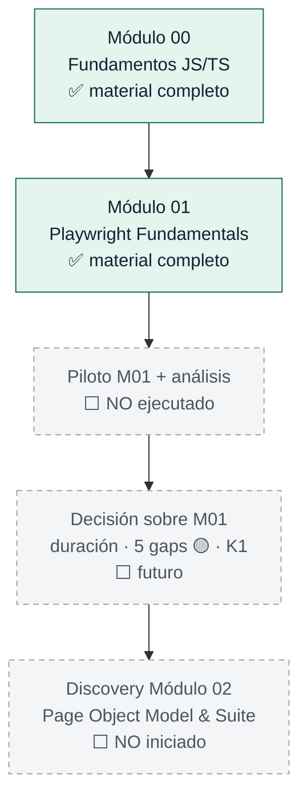
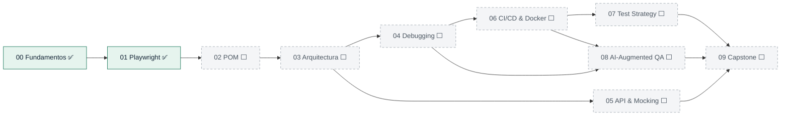
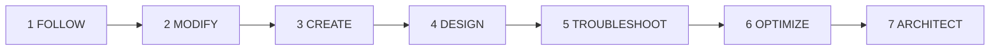

# Mapa del programa

Progresión real del Learning Lab. **Los elementos marcados como futuros no han ocurrido**: no hay piloto ejecutado, ni decisión sobre M01, ni discovery de M02.

---

## Estado de avance

| Etapa | Estado hoy | Qué la desbloquea |
|---|---|---|
| Módulo 00 | ✅ Material completo | — |
| Módulo 01 | ✅ Material completo, operacionalmente preparado | — |
| Piloto M01 + análisis | ⬜ No ejecutado | Grupo real de alumnos y una impartición completa |
| Decisión sobre M01 | ⬜ Futuro | Datos del piloto según el [plan](/learning/docs/module-01-pilot-plan.md) |
| Discovery M02 | ⬜ No iniciado | Cierre de la decisión sobre M01 |

## Los 10 módulos

El programa completo son diez módulos; solo los dos primeros están construidos. El resto están **diseñados en el mapa, no escritos**.

Objetivos, contenidos, duración, dependencias y anclajes en el repositorio de cada módulo: [Learning path](/learning/docs/learning-path.md). Prioridad de desarrollo si el calendario aprieta: [Índice de módulos](/learning/modules/README.md).

## Progresión pedagógica

Siete niveles, del más guiado al más autónomo. Cada módulo declara en cuál trabaja.

| Nivel | Qué hace el alumno | Dónde aparece hoy |
|---|---|---|
| 1 · FOLLOW | Sigue una guía sobre código existente | M00 Lab 1 · M01 Lab 1 |
| 2 · MODIFY | Cambia código que ya funciona | M00 Lab 2 · M01 Labs 2, 3, 6 |
| 3 · CREATE | Escribe algo nuevo | M00 Lab 3 · M01 Lab 4 y Challenge |
| 4 · DESIGN | Elige entre alternativas y lo justifica | M01 Lab 3 y Challenge |
| 5 · TROUBLESHOOT | Encuentra la causa raíz de un fallo | M00 Lab 4 · M01 Lab 5 |
| 6 · OPTIMIZE | Mejora algo que funciona, con métrica | Módulos 06 y 08 (no construidos) |
| 7 · ARCHITECT | Diseña la solución completa | Módulo 09 (no construido) |
