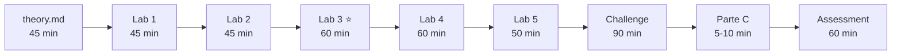

# Módulo 01 — Playwright Fundamentals

**Hub del módulo.** Desde aquí se llega a todo lo del módulo 01: material del alumno, plan del formador y documentación de diseño. El contenido detallado vive en los documentos canónicos que se enlazan; aquí no se duplica.

> **Estado:** ✅ material construido y operacionalmente preparado · ⬜ **piloto NO ejecutado**
>
> **Duración prevista:** 8 h dirigidas + 3 h de trabajo personal + 1 h de assessment ≈ **12 h** *(provisional: sale del diseño, no de una impartición real)*
>
> **Nivel dominante:** 2 · MODIFY → 4 · DESIGN, con un pico en 5 · TROUBLESHOOT
>
> **Depende de:** [Módulo 00](/learning/modules/00-foundations/README.md) superado

Documento canónico del módulo: [`modules/01-playwright-fundamentals/README.md`](/learning/modules/01-playwright-fundamentals/README.md).

---

## Objetivo

Que el alumno pase de **leer** el código de la suite a **ejecutarla, interpretarla y escribir tests propios**, con locators y aserciones elegidos con criterio.

> Este proyecto localiza elementos de una sola manera. Tú vas a aprender a elegir la más apropiada para cada caso — y a justificar por qué.

La suite usa `[data-test="…"]` 66 veces y `getByRole` una sola. El módulo existe en ese hueco.

**Lo que el módulo no es:** ni un tour por la API, ni un repaso del módulo 00, ni diseño de Page Objects (eso es M02), ni diagnóstico de los 10 fallos intencionados (eso es M04).

Los 8 objetivos evaluables P1-P8 y su trazabilidad: [learning-objectives.md](/learning/modules/01-playwright-fundamentals/learning-objectives.md).

## Estructura

| Documento | Qué es |
|---|---|
| [theory.md](/learning/modules/01-playwright-fundamentals/theory.md) | El 20% teórico, anclado en ficheros reales (~45 min de lectura) |
| [locator-reference.md](/learning/modules/01-playwright-fundamentals/locator-reference.md) ⭐ | Tabla de decisión de locators, medida contra la aplicación |
| [repository-mapping.md](/learning/modules/01-playwright-fundamentals/repository-mapping.md) | 38 anclajes concepto → fichero y línea reales |
| [labs/](/learning/modules/01-playwright-fundamentals/labs/README.md) | 5 Labs obligatorios + 1 opcional |
| [challenges/](/learning/modules/01-playwright-fundamentals/challenges/README.md) | 1 Challenge sin pasos |
| [assessment/](/learning/modules/01-playwright-fundamentals/assessment/README.md) | Evaluación de 1 h, aprobado en 70 |

## Ruta del alumno

**El orden no es una sugerencia: es una cadena de dependencias.** El Challenge exige los cinco Labs completos y la Parte C se defiende sobre su `decisiones.md`.

## Labs

| Lab | Nivel | Qué se hace | Estado inicial | Tiempo |
|---|---|---|---|---|
| [Lab 1 — La suite real](/learning/modules/01-playwright-fundamentals/labs/lab-1-suite-real.md) | 1 FOLLOW | Ejecuta la suite de seis formas e interpreta la salida | 69 ✅ / 10 ❌ | 45 min |
| [Lab 2 — Por qué nadie espera](/learning/modules/01-playwright-fundamentals/labs/lab-2-auto-waiting.md) | 2 MODIFY | Rompe el auto-waiting a propósito y mide el coste | Verde | 45 min |
| [Lab 3 — Elegir el locator correcto](/learning/modules/01-playwright-fundamentals/labs/lab-3-locators.md) ⭐ | 2 MODIFY → 4 DESIGN | Construye su tabla de decisión de locators | Verde | 60 min |
| [Lab 4 — El test que falta](/learning/modules/01-playwright-fundamentals/labs/lab-4-test-que-falta.md) | 3 CREATE | Escribe dos tests para huecos de cobertura reales | Vacío | 60 min |
| [Lab 5 — El test que a veces pasa](/learning/modules/01-playwright-fundamentals/labs/lab-5-troubleshoot.md) | 5 TROUBLESHOOT | Diagnostica dos fallos auténticos de localización | **Rojo (2 fallos)** | 50 min |
| [Lab 6 — Codegen](/learning/modules/01-playwright-fundamentals/labs/lab-6-codegen.md) *(opcional)* | 2 MODIFY | Genera un test con `codegen` y lo critica | — | 30 min |

**El Lab 3 es el centro del módulo.** Si el tiempo aprieta se recorta el Lab 6 y parte del Lab 1, nunca el 3.

## Challenge

[Challenge 1 — Compra completa](/learning/modules/01-playwright-fundamentals/challenges/challenge-1-compra-completa.md): diseñar la cobertura de un escenario de negocio completo (90 min, niveles 3 CREATE + 4 DESIGN), con criterios de aceptación AC1-AC6 y un `decisiones.md` que justifica cada elección. **No es opcional:** es la única evidencia del objetivo P8.

## Assessment

[Assessment del módulo](/learning/modules/01-playwright-fundamentals/assessment/README.md) — 1 h, aprobado en 70.

| Parte | Duración | Cuándo |
|---|---|---|
| A — Conocimiento | 15 min | Después de la sesión 6 |
| B — Escribir y diagnosticar | 40 min | Después de la sesión 6 |
| C — Defensa individual | 5-10 min por alumno | En la sesión 6, sobre el `decisiones.md` del Challenge |

## Criterios de superación

1. Labs 1-5 completos: los 2 fallos iniciales de la sandbox en verde y los tests nuevos también.
2. `npx tsc --noEmit` sin errores.
3. `git status --short` solo muestra ficheros dentro de `learning/student/sandbox/`.
4. El `03-decisiones.md` justifica cada locator con **uno de los cinco criterios**, no con "porque funciona".
5. Challenge entregado con sus AC1-AC6 y su `decisiones.md`.
6. ≥ 70 en las partes A y B del assessment.
7. **Apto** en la Parte C.

## Para el formador

| Documento | Para qué |
|---|---|
| [Sesiones 03-06 — plan minuto a minuto](/learning/trainer/session-plans/session-03-module-01.md) | Bloques, tiempos, puestas en común y por qué existe la sesión 6 |
| [Guía del formador](/learning/docs/trainer-guide.md) | Cómo se imparte el Learning Lab en general |
| [Rúbrica general](/learning/docs/assessment-rubric.md) | Los cuatro niveles de las 13 competencias |

**Si el README del módulo y el plan de sesión discrepan en tiempos, manda el plan de sesión.**

## Requisito de entorno

A diferencia del módulo 00, **este módulo no funciona sin red**: necesita navegadores instalados (~500 MB por equipo) y acceso a `saucedemo.com`. La instalación ocupa media hora de la sesión 3 y no es negociable.

Si la comprobación de entorno falla por red, proxy o certificados, el alumno **para y avisa al formador**: es el riesgo **K1**, tiene plan alternativo y **sigue PENDIENTE de validación durante la formación en HDI**.

## Estado actual

| Elemento | Estado |
|---|---|
| Material del módulo (teoría, Labs, Challenge, Assessment, soluciones) | ✅ Completo |
| Piloto con alumnos | ⬜ **NO ejecutado.** Sin participantes ni datos |
| Duración de 12 h | Provisional, a confirmar con el piloto |
| Riesgo K1 (entorno / red HDI) | 🟠 PENDIENTE |
| Los cinco gaps 🟡 de la [revisión pedagógica](/learning/docs/module-01-pedagogical-review.md) | ⬜ Identificados, **ninguno implementado** |
| Decisión de cierre de M01 | ⬜ Futura, con datos del piloto |

Documentación de diseño del módulo: [Discovery &amp; Design](/learning/docs/module-01-discovery-design.md) · [Validación técnica](/learning/docs/module-01-technical-validation.md) · [Revisión pedagógica](/learning/docs/module-01-pedagogical-review.md) · [Piloto](/piloto.md).
