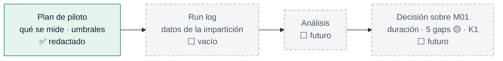

# Piloto / Diseño

Documentación **interna** del programa: cómo se diseñó el material, cómo se validó técnicamente y cómo se medirá cuando se imparta. **No forma parte del recorrido del alumno.**

> ## El piloto del Módulo 01 NO se ha ejecutado
>
> No hay participantes, ni datos, ni resultados, ni conclusiones. Todo lo que sigue son **protocolos e hipótesis**.

---

## Los dos documentos del piloto

| Documento | Qué es | Estado |
|---|---|---|
| [Plan de piloto](/learning/docs/module-01-pilot-plan.md) | **Qué se mide y con qué criterios.** Objetivo, tamaño del grupo, métricas de tiempo, bloqueos, resultados, criterios de éxito y qué se decide después | Protocolo cerrado. No contiene resultados |
| [Registro de ejecución](/learning/docs/module-01-pilot-run-log.md) | **Dónde se registrarán los datos** cuando el piloto se ejecute: reloj de sesión, ficha por participante, bloqueos, notas del assessment | **Vacío a propósito.** Todas las celdas de dato sin rellenar |

**Plan = protocolo. Run log = cuaderno.** Si los dos discrepan, manda el plan.

## Qué decide el piloto

| Pregunta abierta | Estado |
|---|---|
| ¿Las 12 h por alumno son realistas? | Sin datos. La estimación sale del diseño |
| ¿Qué pasa con los **cinco gaps 🟡** de la revisión pedagógica? | Identificados y documentados. **Ninguno implementado**: se deciden con datos |
| ¿El entorno de HDI permite ejecutar contra `saucedemo.com` (**riesgo K1**)? | 🟠 PENDIENTE — se valida durante la formación en HDI |
| ¿La revisión cruzada de la sesión 6 aporta algo? | Es un experimento explícito del piloto, sin resultado |

## Documentación de diseño del Módulo 01

| Documento | Qué contiene |
|---|---|
| [Fase 1 — Diseño del Learning Lab](/learning/phase-1-learning-lab-design.md) | Análisis del repositorio, defectos catalogados y arquitectura del programa completo |
| [Discovery &amp; Design M01](/learning/docs/module-01-discovery-design.md) | Diseño del módulo antes de construir el material |
| [Validación técnica M01](/learning/docs/module-01-technical-validation.md) | K1 (entorno) y K2 (locators) medidos contra la aplicación real |
| [Revisión pedagógica M01](/learning/docs/module-01-pedagogical-review.md) | Auditoría final del módulo: hallazgos y los cinco gaps 🟡 |

## Regla de higiene del piloto

El run log existe para **registrar**, no para interpretar. Los datos se leen al terminar, con el plan delante — no durante la sesión, ni con la impresión del momento.
